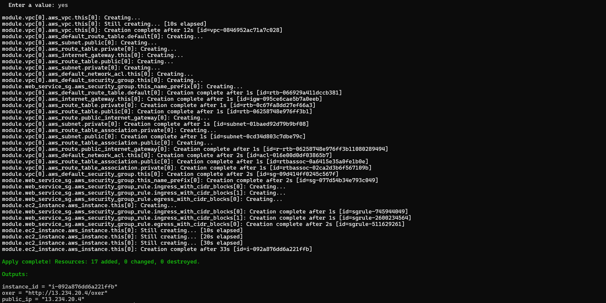

## USING-PUBLIC-MODULES
In this project, I have used modules which were created by provider i.e, aws
These are publicly available modules with detailed documentation, [refer here](https://registry.terraform.io/browse/modules?provider=aws) for official docs
### Benefits of using modules
* Creation of resources is faster, Convinience and time saving
* No manual interaction
* Helps in creating specific module related resources

With the help of this freely available specific provider modules, I have created below said services of aws

**VPC**
* This module helped me in creating Vpc related resources by passing our own arguments
* [refer here](https://registry.terraform.io/modules/terraform-aws-modules/vpc/aws/latest) for official docs

**SECURITY-GROUP**
* This module helped me in creating security-group related resources by passing our own arguments
* [refer here](https://registry.terraform.io/modules/terraform-aws-modules/security-group/aws/latest) for official docs

**EC2**
* This module helped me in creating Ec2 instance related resources by passing our own arguments
* [refer here](https://registry.terraform.io/modules/terraform-aws-modules/ec2-instance/aws/latest) for official docs 

Here, I created required resources like `Vpc`, `Security-group`, `Ec2` with the help of modules block

[refer here]()

Then, Initialized the backend and provider

```bash
  terraform init
  ```


Now, I applied with '.tfvars' file
```bash
  terraform plan 
  terraform apply -var-file="sample.tfvars"
  ```



After successful execution of my desired state, Then I was able to create resources as shown below in my aws account

**VPC**


**EC2**


And, I was also able to run my application on port 80 by typing below url on a browser

http://13.234.20.4/oxer


Now, I destroyed all my resorces at one shot by typing

```bash
  terraform destroy -var-file="sample.tfvars"
  ```


<!-- BEGIN_TF_DOCS -->
## Requirements

| Name | Version |
|------|---------|
| <a name="requirement_aws"></a> [aws](#requirement\_aws) | ~> 5.0 |

## Providers

No providers.

## Modules

| Name | Source | Version |
|------|--------|---------|
| <a name="module_ec2_instance"></a> [ec2\_instance](#module\_ec2\_instance) | terraform-aws-modules/ec2-instance/aws | n/a |
| <a name="module_vpc"></a> [vpc](#module\_vpc) | terraform-aws-modules/vpc/aws | n/a |
| <a name="module_web_service_sg"></a> [web\_service\_sg](#module\_web\_service\_sg) | terraform-aws-modules/security-group/aws | n/a |

## Resources

No resources.

## Inputs

| Name | Description | Type | Default | Required |
|------|-------------|------|---------|:--------:|
| <a name="input_ec2_info"></a> [ec2\_info](#input\_ec2\_info) | ec2 instance info | <pre>object({<br/>      name = string<br/>      instance_type          = string<br/>      key_name               = string<br/>      ami = string<br/><br/>    })</pre> | n/a | yes |
| <a name="input_private_subnets"></a> [private\_subnets](#input\_private\_subnets) | private subnets configuration | <pre>list(object({<br/>    cidr_block = string<br/>    azs = string<br/>  }))</pre> | n/a | yes |
| <a name="input_public_subnets"></a> [public\_subnets](#input\_public\_subnets) | public subnets configuration | <pre>list(object({<br/>    cidr_block = string<br/>    azs = string<br/>  }))</pre> | n/a | yes |
| <a name="input_security_group_info"></a> [security\_group\_info](#input\_security\_group\_info) | security group info | <pre>list(object({<br/>    from_port   = number<br/>      to_port     = number<br/>      protocol    = string<br/>      cidr_blocks = string<br/>  }))</pre> | n/a | yes |
| <a name="input_vpc_info"></a> [vpc\_info](#input\_vpc\_info) | Vpc information | <pre>list(object({<br/>      name = string<br/>      cidr_block = string<br/>    }))</pre> | n/a | yes |

## Outputs

| Name | Description |
|------|-------------|
| <a name="output_instance_id"></a> [instance\_id](#output\_instance\_id) | It displays instance id |
| <a name="output_oxer"></a> [oxer](#output\_oxer) | It is the url of sample application |
| <a name="output_public_ip"></a> [public\_ip](#output\_public\_ip) | It displays public ip of instance |
<!-- END_TF_DOCS -->