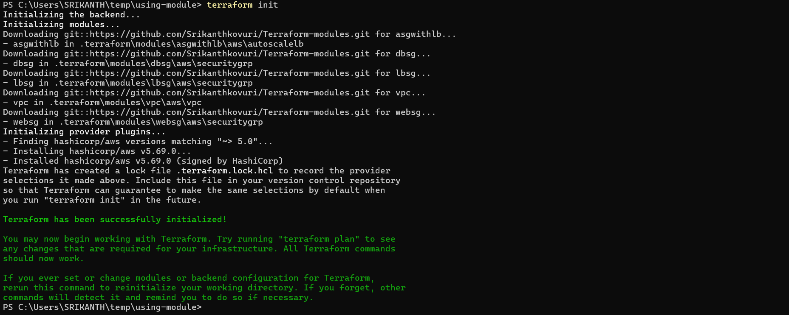
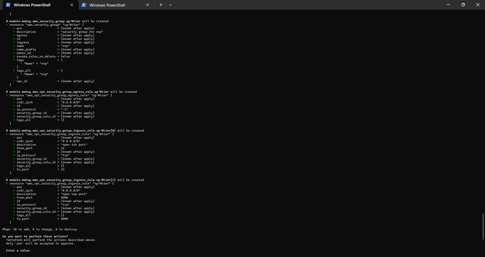
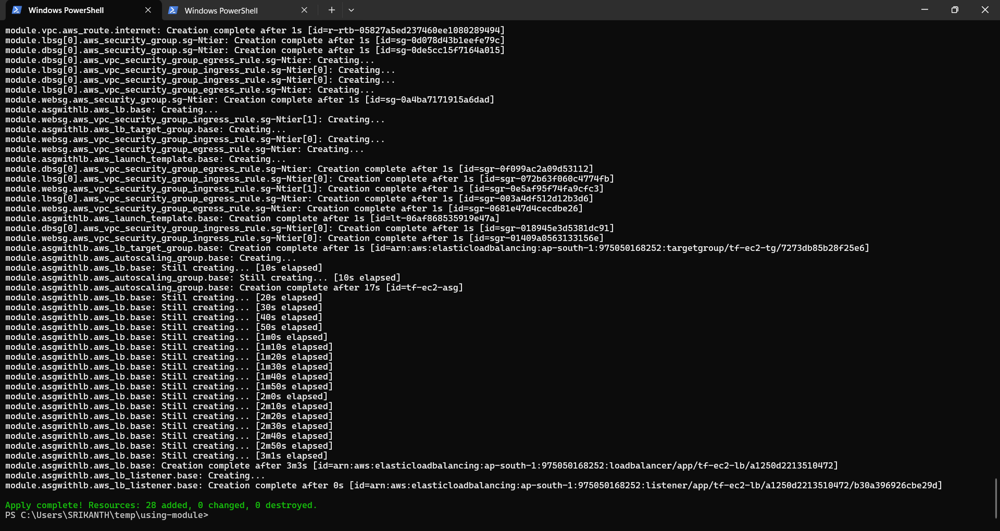
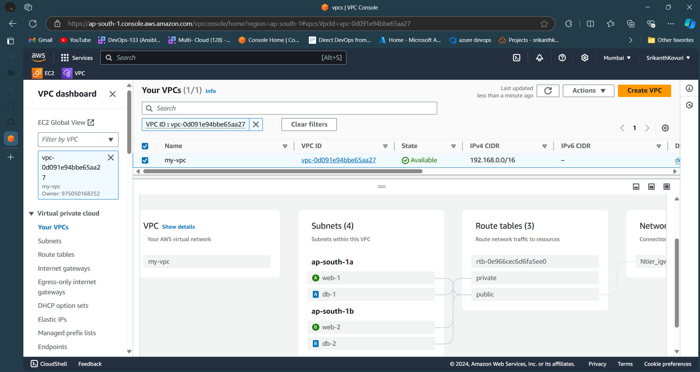
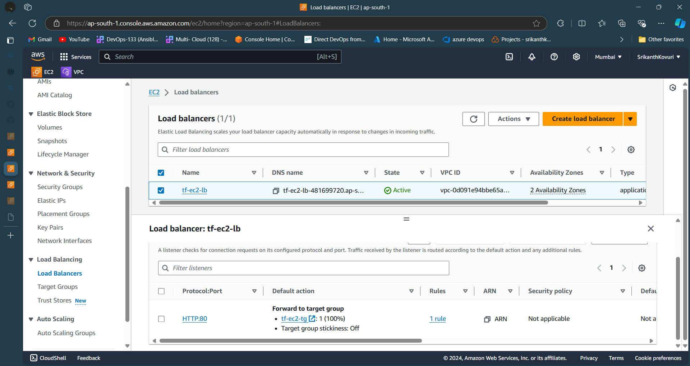
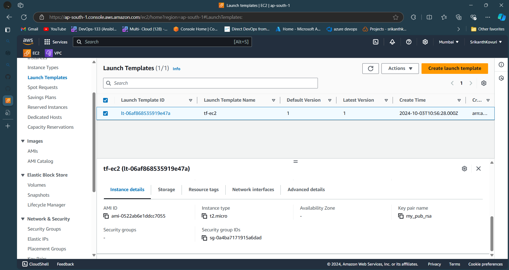
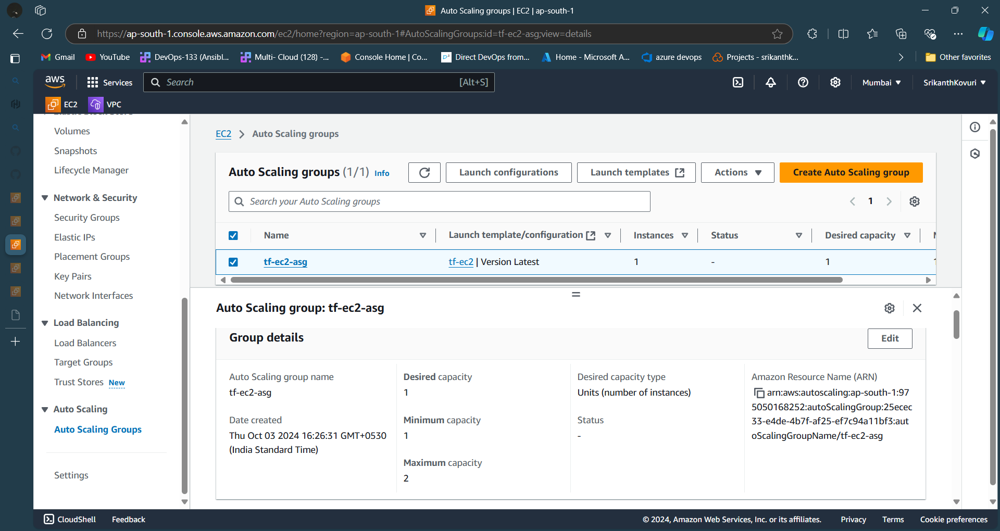
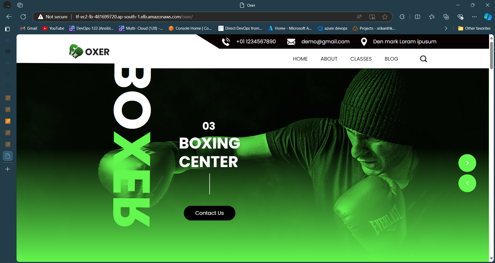
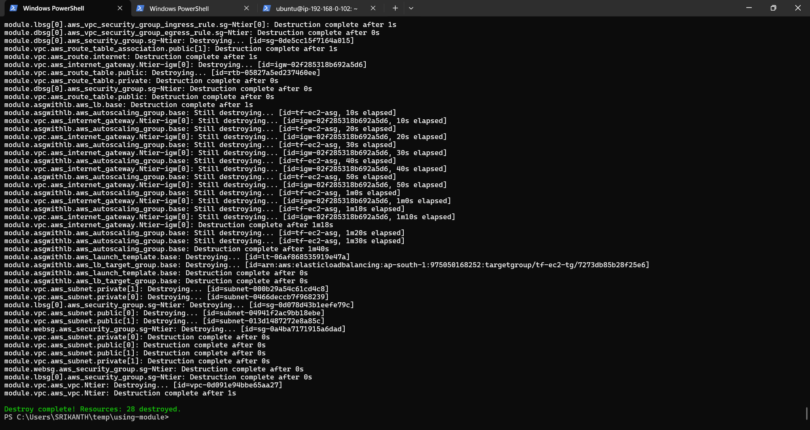

## USING-MY-OWN-MODULES
In this project, I have used modules which were created by provider i.e, aws
These are publicly available modules with detailed documentation, [refer here](https://registry.terraform.io/browse/modules?provider=aws) for official docs
### Benefits of using modules
* Creation of resources is faster, Convinience and time saving
* No manual interaction
* Helps in creating specific module related resources

With the help of this freely available specific provider modules, I have created below said services of aws
- **VPC**
     * This module helped me in creating Vpc related resources by passing our own arguments
     * [refer here](git::https://github.com/Srikanthkovuri/Terraform-modules.git//aws/vpc) for official docs
- **SECURITY-GROUP**
     * This module helped me in creating security-group related resources by passing our own arguments
     * [refer here](git::https://github.com/Srikanthkovuri/Terraform-modules.git//aws/securitygrp) for official docs
- **AUTOSCALEGROUP**
     * This module helped me in creating Autoscale group with load balancer related resources by passing our own arguments
     * [refer here](git::https://github.com/Srikanthkovuri/Terraform-modules.git//aws/autoscalelb) for official docs

Here, I created recources related to `vpc`, `application load balancer with target group`, `autoscalegroup with load balancer`, `launch template from ami` 

[refer here]()

Then, Initialized the and provider

```bash
  terraform init
  ```



Now, I applied with '.tfvars' file
```bash
  terraform plan 
  terraform apply -var-file="sample.tfvars"
  ```



After successful execution of my desired state, Then I was able to create resources as shown below in my aws account

**VPC**



**Load Balancer**



**Launch Tempalate**



**Auto Scale Group with LB**



And, I was also able to run my application on port 80 by typing below dns of a load balancer on a browser

`http://<dns>/oxer`



Now, I destroyed all my resorces at one shot by typing

```bash
  terraform destroy -var-file="sample.tfvars"
  ```



<!-- BEGIN_TF_DOCS -->
## Requirements

| Name | Version |
|------|---------|
| <a name="requirement_aws"></a> [aws](#requirement\_aws) | ~> 5.0 |

## Providers

No providers.

## Modules

| Name | Source | Version |
|------|--------|---------|
| <a name="module_asgwithlb"></a> [asgwithlb](#module\_asgwithlb) | git::https://github.com/Srikanthkovuri/Terraform-modules.git//aws/autoscalelb | n/a |
| <a name="module_dbsg"></a> [dbsg](#module\_dbsg) | git::https://github.com/Srikanthkovuri/Terraform-modules.git//aws/securitygrp | n/a |
| <a name="module_lbsg"></a> [lbsg](#module\_lbsg) | git::https://github.com/Srikanthkovuri/Terraform-modules.git//aws/securitygrp | n/a |
| <a name="module_vpc"></a> [vpc](#module\_vpc) | git::https://github.com/Srikanthkovuri/Terraform-modules.git//aws/vpc | n/a |
| <a name="module_websg"></a> [websg](#module\_websg) | git::https://github.com/Srikanthkovuri/Terraform-modules.git//aws/securitygrp | n/a |

## Resources

No resources.

## Inputs

| Name | Description | Type | Default | Required |
|------|-------------|------|---------|:--------:|
| <a name="input_ami_info"></a> [ami\_info](#input\_ami\_info) | amazon machine image id | `string` | `"ami-0522ab6e1ddcc7055"` | no |
| <a name="input_db_security_group_info"></a> [db\_security\_group\_info](#input\_db\_security\_group\_info) | db security group info | <pre>list(object({<br/>    from_port   = number<br/>    to_port     = number<br/>    ip_protocol = string<br/>    cidr_ipv4   = string<br/>  }))</pre> | n/a | yes |
| <a name="input_ec2_info"></a> [ec2\_info](#input\_ec2\_info) | ec2 instance info | <pre>object({<br/>    name          = string<br/>    instance_type = string<br/>    key_name      = string<br/><br/>  })</pre> | n/a | yes |
| <a name="input_lb_security_group_info"></a> [lb\_security\_group\_info](#input\_lb\_security\_group\_info) | lb security group info | <pre>list(object({<br/>    from_port   = number<br/>    to_port     = number<br/>    ip_protocol = string<br/>    cidr_ipv4   = string<br/>  }))</pre> | n/a | yes |
| <a name="input_private_subnets"></a> [private\_subnets](#input\_private\_subnets) | private subnets configuration | <pre>list(object({<br/>    cidr_block       = string<br/>    available_region = string<br/>    tags = map(string)<br/>  }))</pre> | n/a | yes |
| <a name="input_public_subnets"></a> [public\_subnets](#input\_public\_subnets) | public subnets configuration | <pre>list(object({<br/>    cidr_block       = string<br/>    available_region = string<br/>    tags = map(string)<br/>  }))</pre> | n/a | yes |
| <a name="input_vpc_info"></a> [vpc\_info](#input\_vpc\_info) | vpc information | <pre>object({<br/>    cidr_block = string <br/>  })</pre> | n/a | yes |
| <a name="input_web_security_group_info"></a> [web\_security\_group\_info](#input\_web\_security\_group\_info) | web security group info | <pre>list(object({<br/>    from_port   = number<br/>    to_port     = number<br/>    ip_protocol = string<br/>    cidr_ipv4   = string<br/>  }))</pre> | n/a | yes |

## Outputs

No outputs.
<!-- END_TF_DOCS -->